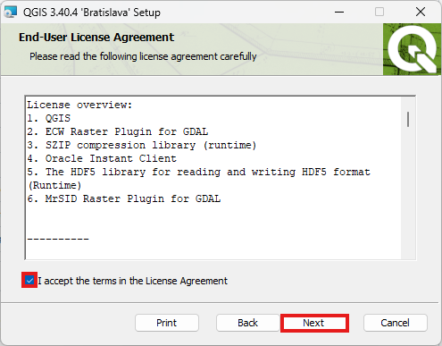
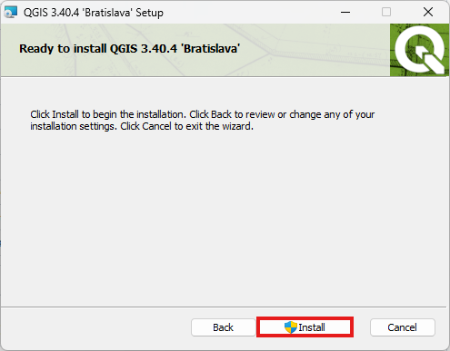

# Plant Population - Cell DEVS Model

## Introduction
This repository presents a **Cell-DEVS Plant Population model** that simulates tree growth, competition, and reproduction under limited environmental resources such as **water**, **nitrogen**, **potassium**, and **sunlight**.

The model is based on the paper *“Simulation of Vegetable Population Dynamics Based on Cellular Automata”* by **Stefania Bandini** and **Giulio Pavesi**, and is implemented using the Cadmium DEVS framework. It captures ecological processes like resource diffusion, growth thresholds, and tree dispersal through localized cell interactions and event-driven updates.

The system is structured using **atomic** and **coupled DEVS models**, ensuring a modular, scalable, and realistic simulation of plant dynamics.

## Repository Structure
This repository is arranged in the following manner:

```sh
.
├── config/                             # Configuration files for each test scenario
│   ├── plant_population_config.json
│   └── plant_population_visualization_config.json
├── log_files/                          # Output CSV logs generated after simulation
│   ├── grid_log.csv
│   └── grid_visualization_log.csv
├── main/                               # Source code directory
│   ├── include/                        # Header files for the model
│   │   ├── plantPopulationCell.hpp     # Defines cell behavior and resource-based state updates
│   │   ├── plantPopulationState.hpp    # Defines cell state: resources, tree type, and height
│   │   └── plantResources.hpp          # Defines and compares cell resources (water, sunlight, nitrogen, potassium)
│   │   └── plantSpeciesInfo.hpp        # Defines species-specific parameters including supported soil types
│   ├── main.cpp                        # Main file to simulate the full system
│   └── CMakeLists.txt                  # CMake configuration for the main directory
├── simulation_videos/                  # WebM simulation outputs for each test
│   ├── initialTest.webm
│   ├── test1.webm
│   └── test2.webm
├── build_sim.sh                        # Build script for Cadmium simulation
├── CMakeLists.txt                      # Root-level CMake configuration
├── .gitignore                          # Git ignore file
└── README.md                           # Project documentation
```

## System Components (Atomic and Coupled Models)

This project includes one **atomic model** that defines the behavior of each plant cell, and a **coupled model** automatically generated using Cadmium’s Grid Cell-DEVS infrastructure to simulate interactions across the grid.

### **1. plantPopulation (Atomic Cell-DEVS)**  
**File:** [`plantPopulationCell.hpp`](main/include/plantPopulationCell.hpp)  

The **plantPopulation** atomic model defines the local behavior of each cell. At every simulation step, each cell:
- Exchanges **water**, **sunlight**, **nitrogen**, and **potassium** with neighboring cells through diffusion.  
- **Produces** its own resources.  
- Determines whether to **survive** or **grow** based on resource thresholds.  
- **Increments tree height** or **dies** based on environmental conditions.  
- **Restricts tree growth** based on **soil type**, defined using the new `plantSpeciesInfo.hpp` mapping.  
- Supports **water regions (e.g., lakes)** which only share water and do **not support tree growth**.

---

### **2. Grid Coupled Model**  
**Constructed in:** [`main.cpp`](main/main.cpp)
  
**Type:** `GridCellDEVSCoupled<plantPopulationState, double>`

The **Grid Coupled Model** automatically connects a grid of `plantPopulation` atomic models using the **Von Neumann neighborhood**. Each cell interacts with its neighbors, allowing for realistic spatial dynamics such as:
- Resource distribution across the grid.
- Propagation of tree types.
- Local competition and survival mechanisms.

The coupled model is instantiated from a JSON configuration file and executed using Cadmium’s simulation engine, with outputs logged to either `grid_log.csv` or `grid_visualization_log.csv`, depending on the selected config file.

## Dependencies
This project assumes that you have Cadmium installed in a location accessible by the environment variable $CADMIUM.
_This dependency would be met by default if you are using the DEVSsim servers. To check, try `echo $CADMIUM` in the terminal_

## Build
To build this project, run:
```sh
source build_sim.sh
```

__NOTE__: Everytime you run build_sim.sh, the contents of `build/` and `bin/` will be replaced.


## **Main Simulation Files**  

This section contains the main file used to execute and test the **Plant Population Simulation**. The simulation is configured using a single JSON file located in the `config/` folder.

### **Main Simulation File**  
**File:** [main.cpp](main/main.cpp)  

This file initializes and runs the **Plant Population Model** using **Cadmium**. It loads the configuration file specified at runtime and simulates the evolution of tree populations based on resource availability and defined rules.  

### **Running the Simulation**  

To run the simulation using the main configuration file, use the following command:

```bash
./bin/plant_population config/plant_population_config.json
```

This will generate a log file at `log_files/grid_log.csv`.

## **Simulation Visualization Options**

There are two ways to visualize the output of this simulation: using the [Cell-DEVS Web Viewer](https://devssim.carleton.ca/cell-devs-viewer/) or by integrating with QGIS.

### **Option 1: Visualize with Cell-DEVS Web Viewer**

To view your simulation output in the browser:

1. Run the visualization configuration:

    ```bash
    ./bin/plant_population config/plant_population_visualization_config.json
    ```

2. This will generate a log file at:

    ```bash
    log_files/grid_visualization_log.csv
    ```

3. Visit https://devssim.carleton.ca/cell-devs-viewer/.

4. Upload:

    - `plant_population_visualization_config.json` (from the `config/` folder)
    - `grid_visualization_log.csv` (from the `log_files/` folder)

This tool will render the grid over time and display multiple side-by-side panels—each representing a specific field (e.g., resources, tree height, soil type, elevation, and tree type). This allows you to observe how resources evolve and how trees grow, compete, and spread based on real-time environmental conditions and model rules.

### **Option 2: Visualize on a Real Map with QGIS**

We adapted a custom QGIS plugin to support visualizing tree dynamics on real-world geographic maps.
Below are the three main steps to set it up and use it with our simulation:

#### **Step 1: Install QGIS**

1. Navigate to the following link and click "Skip it and go to download": https://qgis.org/download/

    

2. Press "Long Term Version for Windows (3.40 LTR)"

    

3. When the download finishes, run the installer and press "Next"

    

4. Check "I accept the terms in the License Agreement" and press "Next"

    

5. Press "Next"

    

6. Press "Install"

    

7. Press on the administrative access icon and press "Yes"

    

7. Press "Finish"

    

9. To verify your installation, type in "QGIS" the Windows search. You should see something like the following

    

#### **Step 2: Add the Plugin**

#### **Step 3: Run the Simulation & Visualize**
