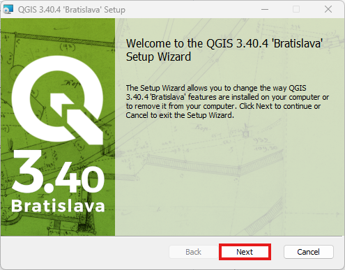
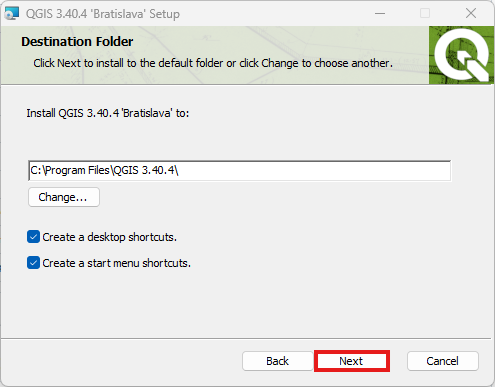

# Plant Population - Advanced Cell DEVS Model

## Introduction
This repository contains the advanced version of the Cell-DEVS Plant Population model. In this version, the configuration file is automatically generated from real-world maps using a **custom QGIS plugin**, and the simulation output is visualized directly on the same map.

To support this integration with QGIS, the model was re-implemented using **asymmetric Cell-DEVS**. Due to time limitations, **tree type differentiation** and **soil type compatibility** were removed from this version, but all other features are fully functional.

## Repository Structure
This repository is arranged in the following manner:

```sh
.
├── config/                             # Configuration file for the simulation
│   ├── map.json
├── doc                                 # Pictures for README
├── log_files/                          # Output CSV log generated after simulation
│   ├── map_log.csv
├── main/                               # Source code directory
│   ├── include/                        # Header files for the model
│   │   ├── plantPopulationCell.hpp     # Defines cell behavior and resource-based state updates
│   │   ├── plantPopulationState.hpp    # Defines cell state: resources, soil type, elevation, tree type, and height
│   │   └── plantResources.hpp          # Defines and compares cell resources (water, sunlight, nitrogen, potassium)
│   │   └── plantSpeciesInfo.hpp        # Defines species-specific parameters including supported soil types
│   ├── main.cpp                        # Main file to simulate the full system
│   └── CMakeLists.txt                  # CMake configuration for the main directory
├── simulation_video/                   # WebM simulation output for advanced model
│   ├── PlantPopulation_simulation.webm
├── build_sim.sh                        # Build script for Cadmium simulation
├── CMakeLists.txt                      # Root-level CMake configuration
├── .gitignore                          # Git ignore file
└── README.md                           # Advanced Model documentation
```

## System Components (Atomic and Coupled Models)

This project includes one **atomic model** that defines the behavior of each plant cell, and a **coupled model** automatically generated using Cadmium’s Grid Cell-DEVS infrastructure to simulate interactions across the grid.

### **1. plantPopulation (Atomic Cell-DEVS)**  
**File:** [`plantPopulationCell.hpp`](main/include/plantPopulationCell.hpp)  

The **plantPopulation** atomic model defines the local behavior of each cell. At every simulation step, each cell:
- Exchanges **water**, **sunlight**, **nitrogen**, and **potassium** with neighboring cells through diffusion.  
- **Produces** its own resources.  
- Determines whether to **survive** or **grow** based on resource thresholds.  
- **Increments tree height** or **dies** based on environmental conditions.
- Supports **water regions (e.g., lakes)** which only share water and do **not support tree growth**.
- This version supports a **single tree type (Locust)** to simplify integration with the QGIS plugin.

---

### **2. Grid Coupled Model**  
**Constructed in:** [`main.cpp`](main/main.cpp)
  
**Type:** `AsymetricCellDEVSCoupled<plantPopulationState, double>`

The **Asymmetric Coupled Model** dynamically connects cells based on the selected region from the map, rather than a fixed rectangular grid. Each cell corresponds to a coordinate on the selected map area and interacts only with its defined neighbors.

This structure allows for more flexible and realistic spatial configurations extracted directly from QGIS. Cells exchange information based on relative positions provided in the configuration file.

Key interactions include:
- Resource distribution across geographically mapped cells.
- Growth and spread of tree populations based on local environmental factors.
- Realistic competition between neighboring cells based on map-based layout.

## Build
To build this project, run:
```sh
source build_sim.sh
```

__NOTE__: Everytime you run build_sim.sh, the contents of `build/` and `bin/` will be replaced.

## **How to Visualize the Simulation**

We adapted a custom QGIS plugin to support visualizing tree dynamics on real-world geographic maps.
Below are the three main steps to set it up and use it with our simulation:

### **Step 1: Install QGIS**

1. Navigate to the following link and click "Skip it and go to download": https://qgis.org/download/

    

2. Press "Long Term Version for Windows (3.40 LTR)"

    

3. When the download finishes, run the installer and press "Next"

    

4. Check "I accept the terms in the License Agreement" and press "Next"

    

5. Press "Next"

    

6. Press "Install"

    

7. Press on the administrative access icon and press "Yes"

    

7. Press "Finish"

    

9. To verify your installation, type in "QGIS" the Windows search. You should see something like the following

    

### **Step 2: Add the Plugin, Get the Configuration File, and Run the Simulation**

To complete this step, follow the short tutorial video linked here. It demonstrates how to install the plugin, extract the configuration file from the map, and run the simulation to generate the output.